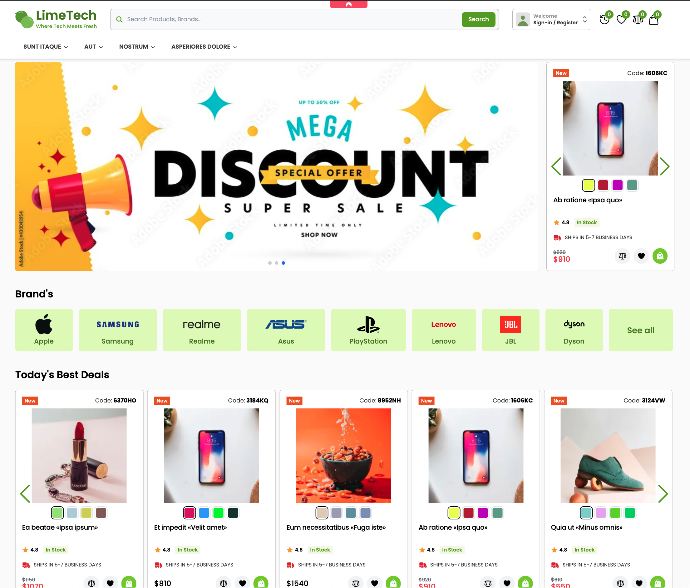
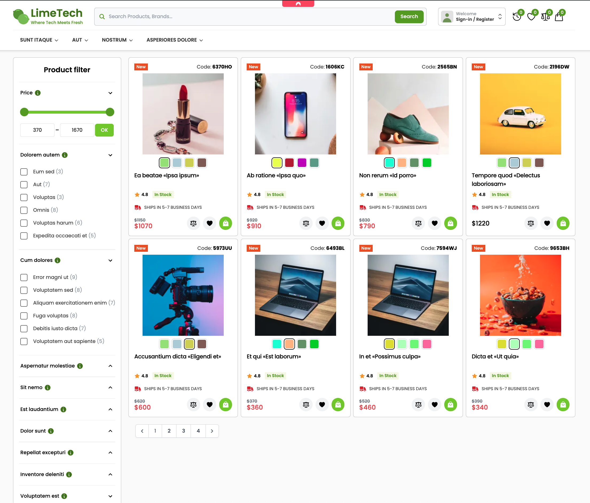
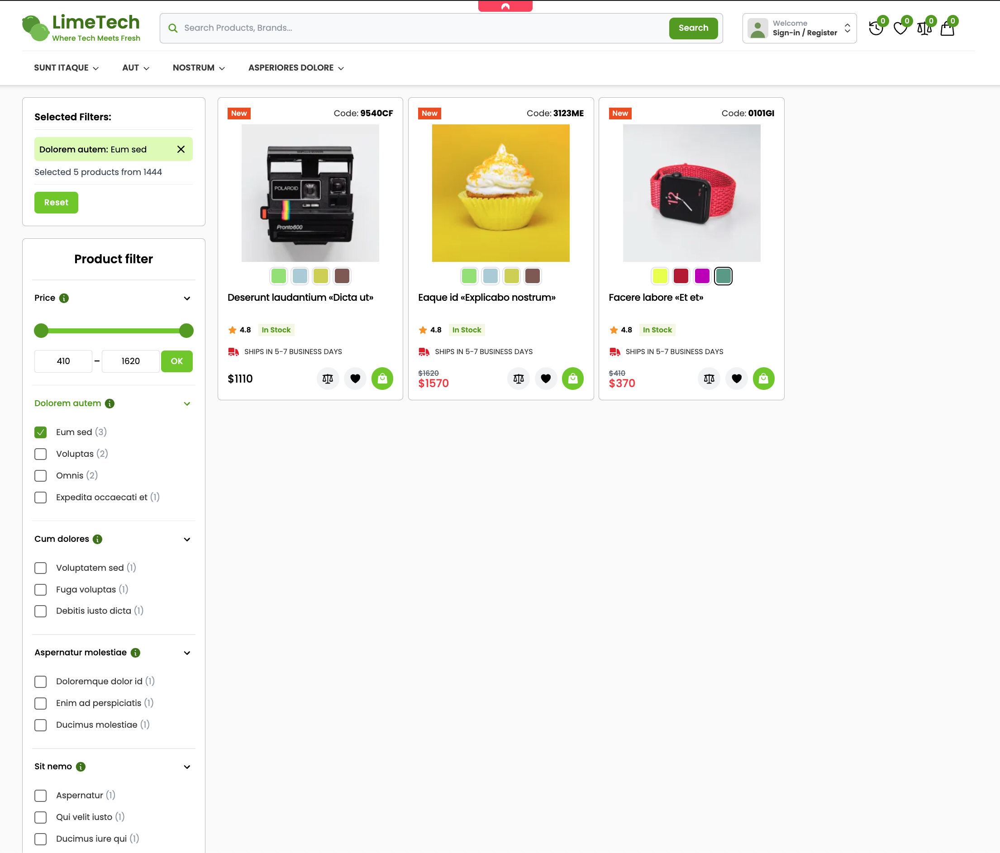
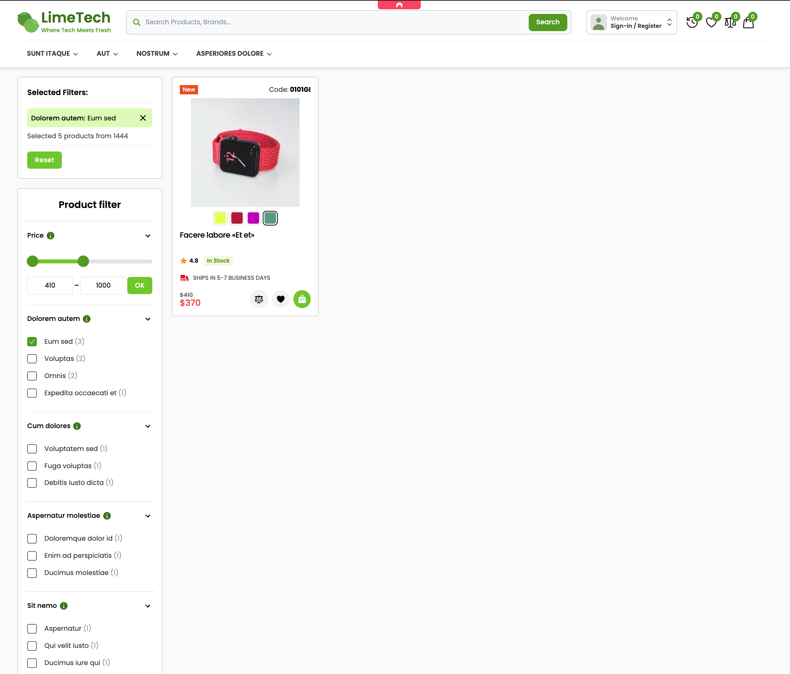
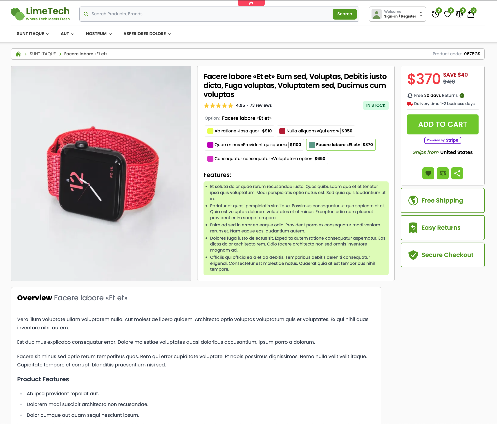
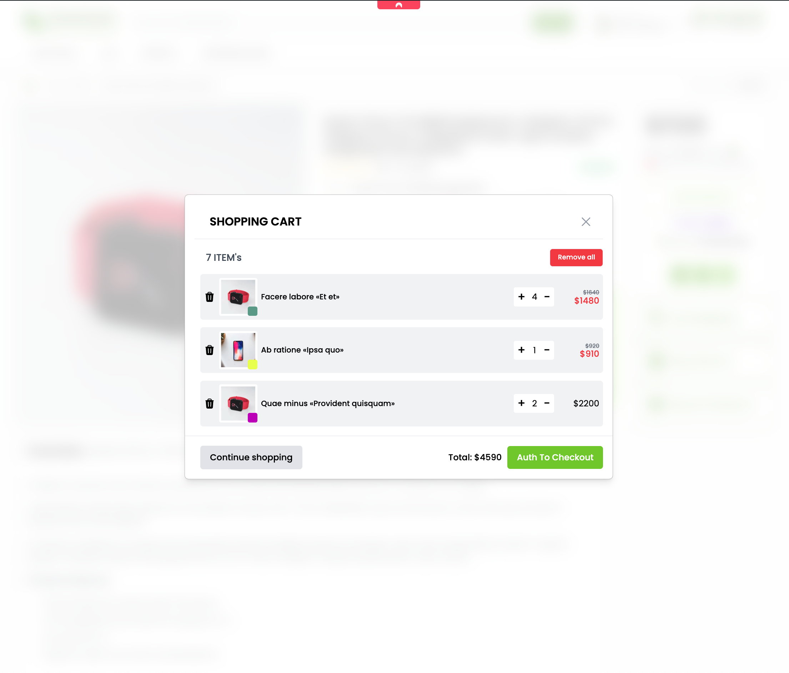
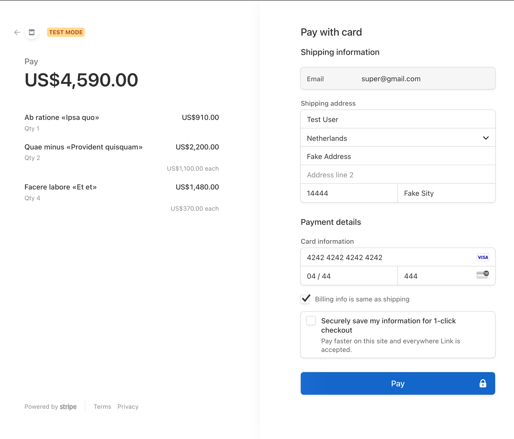
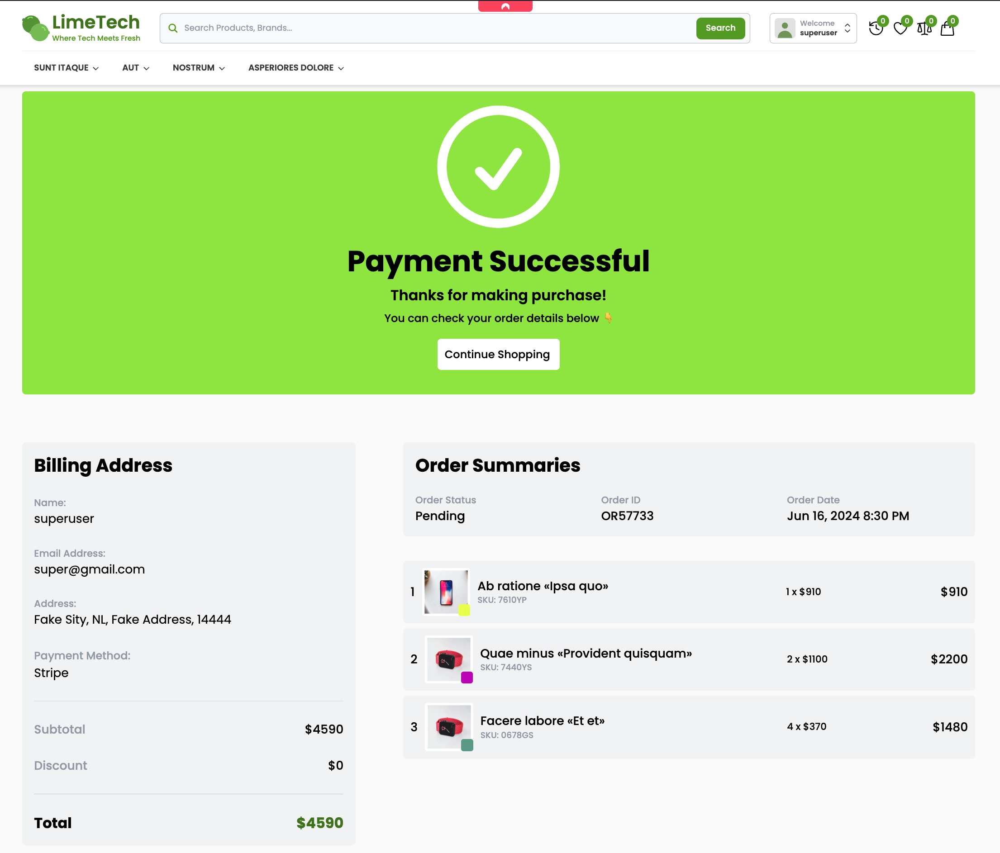

<p align="center">
    
    
</p>
<p align="center">
    
    
</p>
<p align="center">
    
    
</p>
<p align="center">
    
    
</p>

An open source fullstack application for using the [Laravel](https://laravel.com)️, [Filament](https://filamentphp.com)
and [Livewire](https://livewire.laravel.com/).

## Live demo

Admin Panel Credentials:

```bash
demo@gmail.com:root
```

- [BackEnd Admin Panel](http://limetech.my.to/admin)
- [FrontEnd](http://limetech.my.to)

## Running locally via Docker (Sail)

1. Run single Makefile command

```bash
make init
```

And go to [Admin Panel](http://localhost/admin) with credentials **demo@gmail.com:root**

## Troubleshooting

## License

Licensed under the MIT license.
